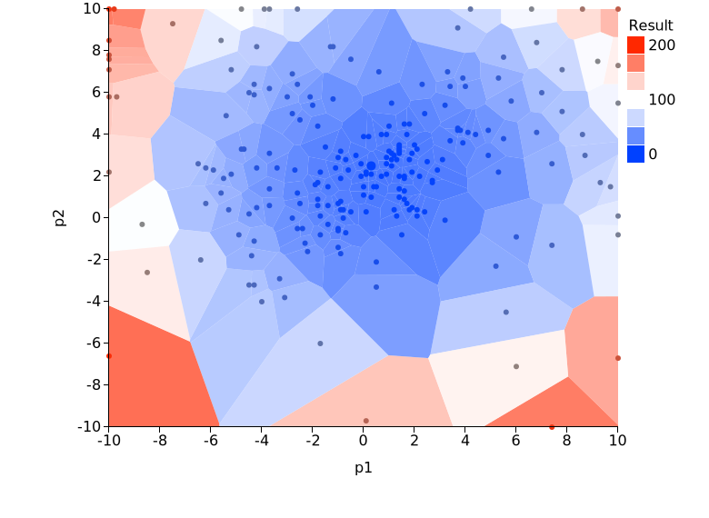

# A sample of optimzation of parameters

This is a sample of optimizing parameters using OACIS watcher.
This program iteratively search for parameters which minimizes the results of the simulations.
For the optimization, we adopted a [differential evolutiion algorithm](https://en.wikipedia.org/wiki/Differential_evolution).

## Prerequisites

Register simulator as follows.

- Name: "de_optimize_test"
- Parameter Definitions:
    - "p1", Float, 0.0
    - "p2", Float, 0.0
- Command:
    - `ruby -r json -e 'j=JSON.load(File.read("_input.json")); f=(j["p1"]-1.0)**2+(j["p2"]-2.0)**2; puts({"f"=>f}.to_json)' > _output.json`
- Input type: JSON
- Executable_on : localhost

The following command will register this simulator in your OACIS.

```
oacis_ruby prepare_simulator.rb
```

# What does this sample code do?

Search a pair of ("p1","p2") which minimizes the result of the simulations.

"de_optimizer.rb" is an optimization engine implementing a differential evolution algorithm. This is a generic routine independent of OACIS APIs.

"optimize_with_oacis.rb" combines OACIS and "de_optimizer.rb". It iteratively finds optimal parameters using the optimizer as a subroutine.

# How to run

Specify the parameters for Differential Evolution algorithm as command line arguments.

```sh
oacis_ruby optimize_with_oacis.rb <num_iterations> <population size> <f> <cr> <seed>
```

For example, run the following.

```sh
oacis_ruby optimize_with_oacis.rb 10 20 0.8 0.9 1234
```

# A sample output

A scatter plot of the sampled parameters. Color scale indicates the simulation outputs.
As you see in the figure, region close to the optimal point is more intensively sampled.



